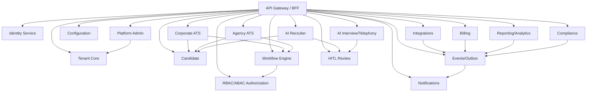
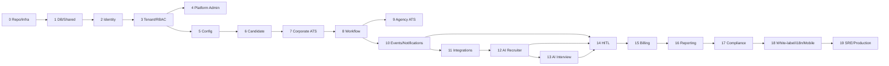

# 00 — Executive Implementation Strategy

## Executive decision

Build gNxtHire first as a **microservice-oriented monorepo using a transitional modular-monolith/shared-PostgreSQL model**.

The database remains shared initially because the regenerated PostgreSQL schema intentionally uses schemas, RLS, and composite tenant-aware foreign keys to enforce correctness. The code, however, must be service/bounded-context oriented from day one. Each service owns specific tables and writes only those tables. Cross-service access happens through APIs, events, or approved read models, not casual private-table joins.

## Non-negotiable rules

- Tenant isolation is structural.
- Platform-admin APIs are separate from tenant-user APIs.
- Client portal users are separate from tenant users.
- Candidate-facing flows are separate from internal user flows.
- Partner/API-key identities are governed identities, not bypass identities.
- AI agents are permission-scoped system actors.
- AI candidate-impacting actions require HITL, audit, configuration, and governance controls.
- Reporting consumes events/facts, not private operational tables.
- Billing consumes usage events, not private AI/integration tables.
- Integrations require idempotency/outbox before provider-specific work.

## Overall service dependency graph

## Phase dependency graph

## Phase list

| Phase | Name | Requirement coverage | Depends on | Must not do |
| --- | --- | --- | --- | --- |
| 0 | Repo, Local Infrastructure, and Engineering Standards | ARCH-19.1, ARCH-19.2, API-18.1, API-18.2, CICD-20.1, CICD-20.2, DEPLOY-17.1 | ready for DB baseline | do not build product features |
| 1 | Database Baseline and Shared Foundations | MT-1.1, MT-1.2, DATA-13.1, DATA-13.4, DATA-13.5, EVT-13.2, API-18.1, SEC-3.6, SEC-3.7, SEC-3.8 | identity can start | do not redesign schema, flatten schemas, remove RLS/FKs, or expose business APIs |
| 2 | Identity Service | SEC-3.1, SEC-3.2, SEC-3.3, SEC-3.8, MT-1.3 partial, API-18.1, API-18.3 partial | authenticated actors ready for RBAC | do not implement RBAC decisions or business screens |
| 3 | Tenant Core, RBAC, and ABAC Authorization | MT-1.3, MT-1.4, MT-1.5, MT-1.6 partial, SEC-3.4, SEC-3.5, RBAC-6.1, RBAC-6.2, RBAC-6.3, RBAC-6.4, API-18.3 partial | platform admin and config can rely on authz | do not expose candidate/requisition data |
| 4 | Platform Admin Service | PA-2.1-PA-2.16, MT-1.2, MT-1.3, MT-1.4, MT-1.10, SEC-3.8 | config framework can use platform definitions | do not mutate tenant domain records directly |
| 5 | Configuration Framework | CFG-11.1, CFG-11.2, CFG-11.3, MT-1.5, MT-1.6, MT-1.7, HITL-14.4 partial | downstream services can consume config | do not build domain logic here |
| 6 | Candidate Service | SEC-3.9, DATA-13.1, DATA-13.5, CAT-4.7 partial, AAT-7.6, INT-10.3 partial | ATS/agency can reference candidates | do not build ATS pipeline or submittals |
| 7 | Corporate ATS Service | CAT-4.1-CAT-4.11, INT-10.3 partial, INT-10.4 partial, INT-10.5 partial | workflow can automate approvals | do not call integrations or enable AI decisions |
| 8 | Workflow and Approval Engine | WF-5.1-WF-5.7, CAT-4.3, RBAC-6.2, RBAC-6.3, HITL-14.4 partial | agency/AI/HITL can reuse workflow | do not execute AI actions or send notifications directly |
| 9 | Agency ATS Service | AAT-7.1-AAT-7.7, MT-1.6, SEC-3.5, SEC-3.9 | billing/reporting can consume agency events | do not invoice here or treat clients as tenants |
| 10 | Event/Outbox, Audit Foundation, and Notification Service | EVT-13.2, EVT-13.3, DATA-13.4, NOTIF-15.1, NOTIF-15.2, NOTIF-15.3, SEC-3.8 | integrations/AI/billing/reporting can rely on events | do not let domains send email directly |
| 11 | Integration Framework | INT-10.1-INT-10.5, API-18.4, MT-1.11, SEC-3.7, DATA-13.4 | AI and billing can use integration patterns | do not put provider logic in domain services |
| 12 | AI Recruiter Service | AIR-8.1-AIR-8.5, CAT-4.4, CAT-4.5, CAT-4.6, CAT-4.10, PA-2.12, PA-2.16 | HITL can review real AI outputs | do not auto-reject/advance/message/schedule |
| 13 | AI Interview and Telephony Service | AIB-9.1, AIB-9.2, AIB-9.5, TEL-9.3, TEL-9.4, AIR-8.4, MOB-21.2 partial | HITL reviews interview outputs | do not auto-advance/reject |
| 14 | Human-in-the-Loop Review Service | HITL-14.1-HITL-14.4, WF-5.5, AIR-8.5, AIB-9.5, PA-2.12, PA-2.16 | billing/reporting/compliance can consume review events | do not enable unrestricted AI |
| 15 | Billing, Subscription, and Metering Service | BILL-16.1-BILL-16.4, MT-1.10, PA-2.2-PA-2.5 | reporting can use billing facts | do not infer usage from private AI tables |
| 16 | Reporting and Analytics Service | RPT-12.1-RPT-12.3, DATA-13.4, DATA-13.5, Phase 7 KPIs, PA-2.11, PA-2.12 | compliance and SRE can use evidence/metrics | do not query private operational tables from frontend |
| 17 | Compliance, Privacy, and Retention Service | SEC-3.8, SEC-3.9, DATA-13.5, PA-2.13, PA-2.14, RPT-12.3, Phase 7 risk/readiness | enterprise readiness can validate compliance | do not hard delete blindly |
| 18 | White-Labeling, Internationalization, and Mobile Readiness | MOB-21.1, MOB-21.2, BRAND-21.3, I18N-21.4, I18N-21.5, MT-1.6, MT-1.8 | production SRE can validate domains/mobile | do not fork frontend per tenant |
| 19 | Production Hardening, SRE, and Enterprise Readiness | DEPLOY-17.1-DEPLOY-17.5, CICD-20.1-CICD-20.4, API-18.2, PA-2.11, PA-2.14, Phase 7 readiness | GA readiness package complete | do not add net-new business scope |

## Pilot strategy

The first enterprise pilot should include identity, tenant/RBAC, platform admin, configuration, candidate, corporate ATS, workflow approvals, events/notifications, and basic reporting. AI may be available only in advisory/review-required mode until HITL governance gates pass.

## Release gates

- RLS and tenant-leakage tests pass across API, DB, search, cache, object storage, event, notification, analytics, and AI prompt contexts.
- Platform support access is reason-coded, time-bound, and audited.
- Usage reconciliation passes before billing enforcement.
- AI outputs are review-gated before candidate impact.
- Zero-downtime migrations are proven in staging.
- SLO dashboards, DR restore, backups, runbooks, and incident response are tested.

## First 30 days summary

The first month should deliver a runnable monorepo, local infra, reproducible DB baseline, shared request/tenant context, validation gates, identity first slice, frontend shells, and a dependency-ordered backlog for tenant/RBAC and platform-admin phases.
