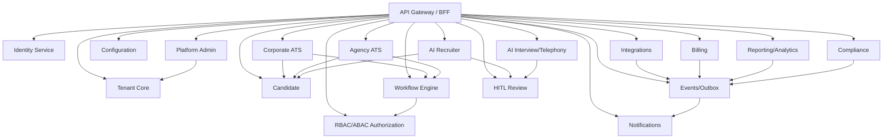
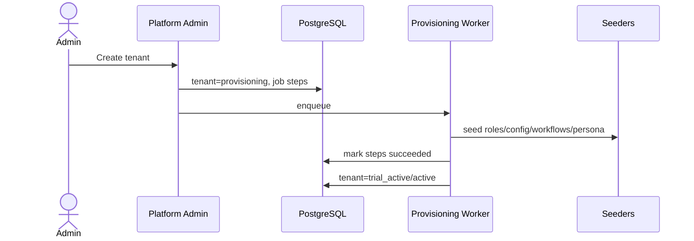

# 01 — Architecture and Service Boundaries

## Target implementation style

Use a **microservice-oriented monorepo** with a **shared PostgreSQL modular-monolith database** at first. PostgreSQL schemas act as hard domain boundaries. This can evolve to true independent services later only after event/API boundaries are stable.

## Boundary rules

- A service may write only owned tables.
- Private tables are not shared just because they are in the same database.
- Cross-service reads go through APIs, domain events, read models, or approved views.
- Workers use the same boundaries as APIs.
- Platform-admin access is not a general bypass.
- RLS remains enabled and forced for tenant-scoped tables.

## Overall dependency graph

## Service boundary table

| Service | Owns | API boundary | Event boundary |
| --- | --- | --- | --- |
| Identity | tenant identity tables and auth/session primitives | /v1/identity | identity/security events |
| Tenant Core/RBAC | tenant org, roles, permissions, ABAC, field permissions, delegations, API keys | /v1/tenants, /v1/rbac | tenant/rbac events |
| Platform Admin | platform tenants, plans, quotas, support, audit, SLO, governance | /v1/platform-admin | platform governance events |
| Config | config definitions, scoped values, change log | /v1/config | config changed events |
| Candidate | candidate master, documents, consent, suppressions, talent pools | /v1/candidates | candidate/consent events |
| Corporate ATS | headcount, requisitions, applications, interviews, offers, onboarding | /v1/corporate-ats | corporate ATS events |
| Workflow | templates, instances, approvals, SLAs, history | /v1/workflows | workflow events |
| Agency ATS | clients, mandates, submittals, client portal, placements | /v1/agency-ats | agency events |
| Events/Notifications | outbox, domain events, notification templates/deliveries | /v1/events, /v1/notifications | event/notification status |
| Integrations | connectors, sync, webhooks, HRMS/calendar mappings | /v1/integrations | integration events |
| AI Recruiter | personas, prompts, sourcing, matching, screening, conversations | /v1/ai-recruiter | AI review/usage/bias events |
| AI Interview | sessions, responses, evaluations, telephony calls | /v1/interviews | interview/telephony events |
| HITL | review queue, decisions, autonomy, override metrics | /v1/hitl | HITL/governance events |
| Billing | subscriptions, usage, invoices, payments | /v1/billing | billing/payment events |
| Reporting | dashboards, reports, analytics facts | /v1/reports | report/export events |
| Compliance | DSR, retention, legal holds, evidence | /v1/compliance | compliance events |

## Tenant provisioning flow

## Service split readiness

Before a bounded context can become an independent microservice with its own database, it must have: stable OpenAPI, stable event contracts, no direct repository imports from other services, operational runbooks, ownership of migrations, and consumer-driven contract tests.
