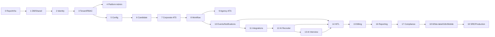

# 02 — Phased Implementation Roadmap

## Phase dependency graph

## Roadmap

| Phase | Name | Objective | Why ordered here | Test focus |
| --- | --- | --- | --- | --- |
| 0 | Repo, Local Infrastructure, and Engineering Standards | Establish monorepo, local infra, coding standards, CI gates, service skeletons, frontend shells, API linting, and security defaults. | First because every later phase needs repeatable setup, route conventions, service boundaries, and automated quality gates. | no business migrations |
| 1 | Database Baseline and Shared Foundations | Load PostgreSQL 16 regenerated schema, create Alembic baseline, shared backend library, request context, RLS validation, audit/event/idempotency primitives. | Identity and domains cannot be safely built until RLS, tenant context, composite FKs, and baseline migrations are reproducible. | baseline revision; future migrations service-owned |
| 2 | Identity Service | Build tenant-user, platform-admin, client-portal, candidate-token, API-key realm foundations with login, sessions, MFA, verification, reset, SSO skeleton, security events. | Every API and RLS context requires a trustworthy actor and realm before tenant/RBAC/domain services. | secure bootstrap for first platform admin |
| 3 | Tenant Core, RBAC, and ABAC Authorization | Build tenant org, users, business units, teams, roles, permissions, role assignments, ABAC, field permissions, delegations, API keys, calendars, branding basics. | Domain services need authorization, user/org structure, and scoped permissions before exposing sensitive data. | seed default roles/permissions |
| 4 | Platform Admin Service | Build separate platform-admin control plane for tenant lifecycle, provisioning, plans, quotas, features, support sessions, audit, tenant health, SLO, AI governance placeholders. | Operations and support controls must exist before broad tenant/domain rollout. | seed platform roles/plans/features if needed |
| 5 | Configuration Framework | Build typed config definitions, scoped values, effective resolution, caching, change log, versioning, rollback, locked settings. | Tenant-specific behavior must be governed before domains hardcode settings. | seed default keys and scopes |
| 6 | Candidate Service | Build candidate master profiles, contacts, documents, consent, suppressions, talent pools, duplicate flags, skills, work/education, EEO-sensitive handling. | ATS, agency, AI, integrations, reporting, and compliance all reference candidates. | seed skill taxonomy carefully |
| 7 | Corporate ATS Service | Build headcount, requisitions, locations/openings, JD/competencies, pipeline stages, applications, interviews, scorecards, offers, pre-joining, onboarding, job posting metadata. | Corporate domain needs candidate/RBAC/config; approval automation comes next via workflow. | seed default pipelines and competencies |
| 8 | Workflow and Approval Engine | Build workflow templates, canvas metadata, steps, transitions, conditions, instances, approvals, SLAs, escalations, simulation, history. | Approval automation should be reusable and follow first corporate domain data model. | seed default workflows |
| 9 | Agency ATS Service | Build clients, contacts, client portal users, mandates, fee terms, retainers, submittals, redacted snapshots, feedback, placements, guarantees. | Agency depends on candidate master and introduces client_id second-level isolation. | seed agency roles and portal scopes |
| 10 | Event/Outbox, Audit Foundation, and Notification Service | Operationalize outbox, domain events, idempotency, subscriptions, notification templates, preferences, suppression, delivery attempts, audit side effects. | Integrations, AI, billing, reporting, and reliable notifications require durable events/idempotency. | seed templates and event types |
| 11 | Integration Framework | Build connector registry, tenant connector instances/settings, health checks, sync jobs/records, webhook events/subscriptions, HRMS mappings, calendar events. | External sync needs events, idempotency, RBAC, config, and domain APIs. | seed connector definitions |
| 12 | AI Recruiter Service | Build AI personas, prompt templates, agent identities, sourcing, match scores, screening results, bias flags, conversations, scheduling, joining-risk, AI usage events. | AI needs candidate/ATS/config/events/integration foundations; candidate-impacting automation waits for HITL. | seed versioned prompts/personas |
| 13 | AI Interview and Telephony Service | Build AI interview sessions, question sets, responses/media, evaluations, flags, low-confidence segments, telephony configs/numbers/routes/calls/quality/live calls. | Requires candidate, ATS, notification, integration, AI governance; outcomes wait for HITL. | seed rubrics/questions |
| 14 | Human-in-the-Loop Review Service | Build unified review queue, routing, decisions, modifications, related items, autonomy configs, override metrics, governance alerts. | AI outputs exist but cannot affect candidates safely until HITL is complete. | seed autonomy configs/reason codes |
| 15 | Billing, Subscription, and Metering Service | Build subscriptions, items, add-ons, quota overrides, usage events/aggregations, addresses, payment methods, invoices, taxes, payment attempts, credits. | Billing requires plans, tenant lifecycle, events, notifications, and real usage event producers. | seed plans/quota/addons |
| 16 | Reporting and Analytics Service | Build dashboards, widgets, reports, filters, columns, schedules, export jobs, metric/dimension definitions, analytics events/facts, benchmarks. | Reporting must follow events/facts, not direct private table reads. | seed metrics/dimensions |
| 17 | Compliance, Privacy, and Retention Service | Build DSR workflows, consent governance, retention policies, legal holds, evidence packages, erasure orchestration, access reviews. | Full compliance requires mature data across domains, AI, events, billing, reports, integrations. | seed frameworks/retention |
| 18 | White-Labeling, Internationalization, and Mobile Readiness | Complete branding, custom domains, localization, mobile device registrations, push readiness, responsive shells, selected offline flows. | Do after real surfaces exist so branding/i18n/mobile cover real workflows consistently. | seed localization keys |
| 19 | Production Hardening, SRE, and Enterprise Readiness | Harden CI/CD, environments, canary/rollback, feature flags, SLO/error budgets, autoscaling, DR, backups, security/load tests, runbooks, incident response. | Final consolidation after product, AI, billing, reporting, compliance, and white-label surfaces exist. | zero-downtime expand/migrate/contract |

## Build checkpoints

### Foundation checkpoint: Phases 0-5
Repo, DB, identity, tenant/RBAC, platform admin, and config must be stable before domain services.

### Core ATS checkpoint: Phases 6-9
Candidate, corporate ATS, workflow, and agency ATS create the operational product backbone.

### Evented automation checkpoint: Phases 10-11
Events, notifications, and integrations provide reliable async operations and provider boundaries.

### AI governance checkpoint: Phases 12-14
AI services build advisory outputs first. HITL enables governed production activation.

### Monetization, insight, compliance checkpoint: Phases 15-18
Billing follows usage events; reporting follows analytics facts; compliance follows mature data surfaces; white-label/mobile follows stable UX.

### Production checkpoint: Phase 19
No net-new scope; hardening, tests, runbooks, DR, SLOs, and enterprise gates.
