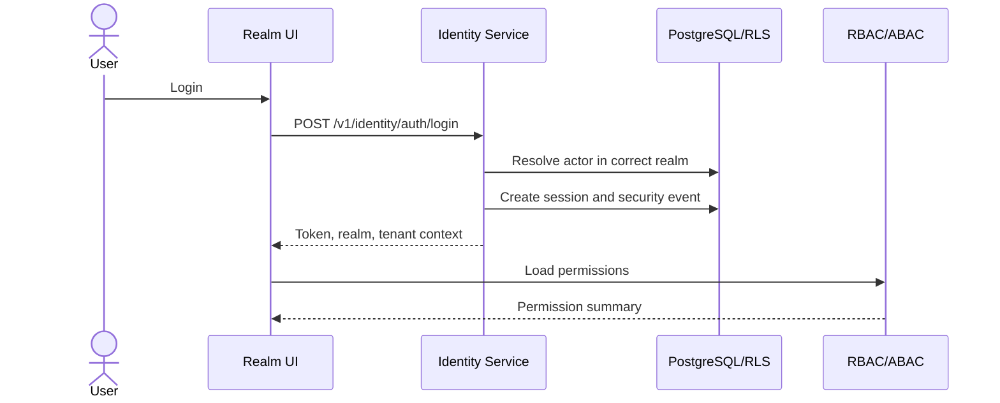

# Phase 2 — Identity Service

## Identity/auth flow

## 1. Objective

Build tenant-user, platform-admin, client-portal, candidate-token, API-key realm foundations with login, sessions, MFA, verification, reset, SSO skeleton, security events.

## 2. Why this phase is ordered here

Every API and RLS context requires a trustworthy actor and realm before tenant/RBAC/domain services.

## 3. Business capabilities delivered

Secure login and realm separation.

## 4. Requirement IDs covered

SEC-3.1, SEC-3.2, SEC-3.3, SEC-3.8, MT-1.3 partial, API-18.1, API-18.3 partial

## 5. Services involved

identity service, session service, security event writer, SSO/SCIM skeleton

## 6. Owned database schemas/tables

tenant.users, user_sessions, user_mfa_factors, reset/verification tokens, sso tables, security_events, platform.platform_users

## 7. APIs to build

/v1/identity/auth/login, logout, refresh, me, forgot-password, reset-password, verify-email, mfa, platform-admin/login

All APIs must follow the standard `/v1` envelope, include `request_id`, document auth requirements in OpenAPI, use cursor pagination for lists, and require idempotency keys for duplicate-prone mutations.

## 8. Events published

identity.login.succeeded, identity.login.failed, identity.user.email_verified, identity.password_reset_requested

All published events use the canonical event envelope and are inserted through the outbox when they follow a database mutation.

## 9. Events consumed

notification send events later

Consumers must be idempotent and may update only their owned tables/read models.

## 10. Background jobs/workers

token cleanup, stale sessions, lockout evaluator

Workers must set tenant context, record attempts, expose metrics, and use bounded retry/backoff.

## 11. External providers involved

SMTP/email adapter, OIDC/SAML sandbox, Redis

Provider integrations must start with sandbox/fake adapters and secret references.

## 12. Security and authorization rules

separate realms; HMAC reset tokens; MFA step-up; account enumeration protection; rate limits

Server-side authorization is mandatory; UI hiding is not sufficient.

## 13. Tenant isolation rules

tenant login resolves verified tenant; platform admin never becomes tenant user

Tenant isolation applies to API, DB, cache, search, object storage, events, notifications, integrations, reports, and AI prompt context.

## 14. RLS/database requirements

tenant identity queries run under tenant context; global platform users separate

RLS validation and cross-tenant negative tests are required before completion.

## 15. Audit/event requirements

all auth attempts and session changes logged

Audit records must include actor, realm, tenant, entity, action, request id, support session id where applicable, and before/after/diff where relevant.

## 16. Configuration dependencies

password, MFA, session, lockout policies as config keys

Tenant-specific behavior must be driven by the configuration framework where a config key exists or is appropriate.

## 17. UI screens/pages/components to build

login, platform login, forgot/reset, verify email, MFA screens

Use the shared design system, permission-aware actions, standardized loading/error/empty states, and audit-sensitive confirmation dialogs.

## 18. Frontend state/data-fetching requirements

realm-specific auth stores and route guards

Use typed API clients, tenant-scoped query keys, route guards, and central error handling with request id display.

## 19. Test plan

password, token, MFA, rate-limit, realm-separation, RLS session tests

Also include unit, integration, contract, authorization, RLS, tenant leakage, idempotency, audit, and frontend route-guard tests where applicable.

## 20. Migration/data requirements

secure bootstrap for first platform admin

Migrations are additive, service-owned, reviewed for tenant isolation, and validated against schema drift checks.

## 21. Rollout plan

email/password first; SSO behind flags

Rollout must use feature flags, internal tenants, seeded data, and explicit rollback notes.

## 22. Definition of done

core auth flows working per realm

## 23. Risks and edge cases

tenant email ambiguity and token leakage

## 24. What must NOT be done in this phase

do not implement RBAC decisions or business screens

## 25. Parallelization opportunities

backend auth and frontend screens parallelize

## 26. Dependencies on previous phases

Phase 1

## 27. Handoff checklist for the next phase

- OpenAPI and event catalog updated.
- Service-to-table ownership matrix updated.
- Required permissions and config keys documented.
- RLS, authorization, tenant leakage, idempotency, and audit tests pass.
- Frontend routes are guarded and permission-aware.
- Runbooks and rollback notes are present.
- Handoff: authenticated actors ready for RBAC
