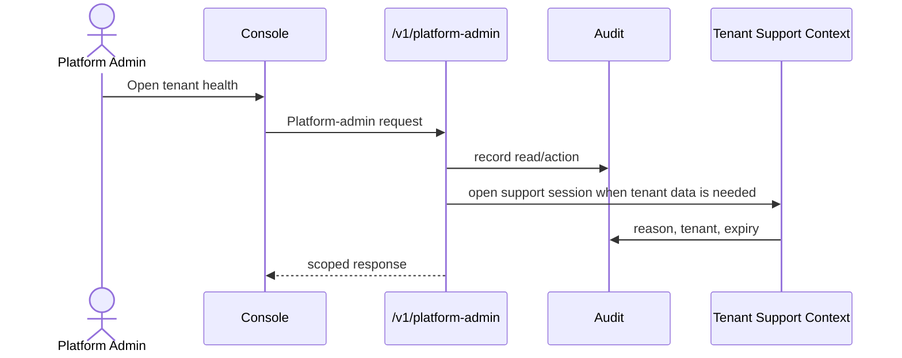
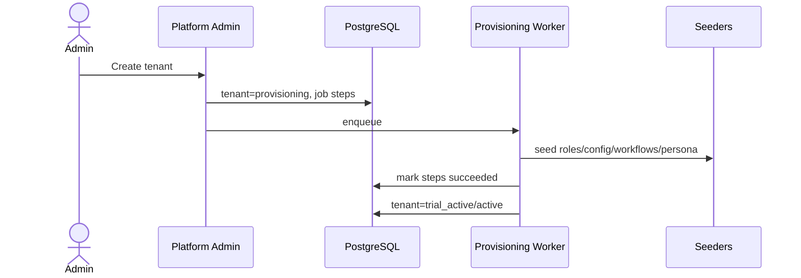

# Phase 4 — Platform Admin Service

## Platform admin tenant management flow

## Tenant provisioning flow

## 1. Objective

Build separate platform-admin control plane for tenant lifecycle, provisioning, plans, quotas, features, support sessions, audit, tenant health, SLO, AI governance placeholders.

## 2. Why this phase is ordered here

Operations and support controls must exist before broad tenant/domain rollout.

## 3. Business capabilities delivered

gNxtHire operators can govern tenants without tenant-user APIs.

## 4. Requirement IDs covered

PA-2.1-PA-2.16, MT-1.2, MT-1.3, MT-1.4, MT-1.10, SEC-3.8

## 5. Services involved

platform admin service, provisioning worker, support-session service, platform audit

## 6. Owned database schemas/tables

platform.tenants, tenant_lifecycle/provisioning, plans, quotas, features, infra_pools, platform users/roles, support, audit, SLO, AI governance

## 7. APIs to build

/v1/platform-admin/tenants, plans, quotas, features, support-sessions, audit-logs, sla, slo, ai-governance

All APIs must follow the standard `/v1` envelope, include `request_id`, document auth requirements in OpenAPI, use cursor pagination for lists, and require idempotency keys for duplicate-prone mutations.

## 8. Events published

platform.tenant.provisioned, platform.tenant.suspended, platform.support_session.opened, platform.feature_flag.changed

All published events use the canonical event envelope and are inserted through the outbox when they follow a database mutation.

## 9. Events consumed

identity platform-admin events

Consumers must be idempotent and may update only their owned tables/read models.

## 10. Background jobs/workers

provisioning retry/rollback, tenant health rollup, support session expiry

Workers must set tenant context, record attempts, expose metrics, and use bounded retry/backoff.

## 11. External providers involved

observability, infra hooks, billing placeholder

Provider integrations must start with sandbox/fake adapters and secret references.

## 12. Security and authorization rules

platform-admin realm only; support sessions reason-coded/time-bound/audited

Server-side authorization is mandatory; UI hiding is not sufficient.

## 13. Tenant isolation rules

cross-tenant access only through platform-admin; no tenant API bypass

Tenant isolation applies to API, DB, cache, search, object storage, events, notifications, integrations, reports, and AI prompt context.

## 14. RLS/database requirements

never disable RLS globally for admin access

RLS validation and cross-tenant negative tests are required before completion.

## 15. Audit/event requirements

audit every admin read/mutation

Audit records must include actor, realm, tenant, entity, action, request id, support session id where applicable, and before/after/diff where relevant.

## 16. Configuration dependencies

feature flags and plan/quota definitions drive rollout

Tenant-specific behavior must be driven by the configuration framework where a config key exists or is appropriate.

## 17. UI screens/pages/components to build

platform admin console: tenants, provisioning, feature flags, support, audit, SLO

Use the shared design system, permission-aware actions, standardized loading/error/empty states, and audit-sensitive confirmation dialogs.

## 18. Frontend state/data-fetching requirements

strict platform route guard; high-risk confirmations

Use typed API clients, tenant-scoped query keys, route guards, and central error handling with request id display.

## 19. Test plan

admin authz, support-session, provisioning idempotency, audit tests

Also include unit, integration, contract, authorization, RLS, tenant leakage, idempotency, audit, and frontend route-guard tests where applicable.

## 20. Migration/data requirements

seed platform roles/plans/features if needed

Migrations are additive, service-owned, reviewed for tenant isolation, and validated against schema drift checks.

## 21. Rollout plan

internal-only, sandbox tenant provisioning

Rollout must use feature flags, internal tenants, seeded data, and explicit rollback notes.

## 22. Definition of done

separate operational control plane live

## 23. Risks and edge cases

admin support becoming bypass

## 24. What must NOT be done in this phase

do not mutate tenant domain records directly

## 25. Parallelization opportunities

admin UI and provisioning parallel

## 26. Dependencies on previous phases

Phases 2 and 3

## 27. Handoff checklist for the next phase

- OpenAPI and event catalog updated.
- Service-to-table ownership matrix updated.
- Required permissions and config keys documented.
- RLS, authorization, tenant leakage, idempotency, and audit tests pass.
- Frontend routes are guarded and permission-aware.
- Runbooks and rollback notes are present.
- Handoff: config framework can use platform definitions
