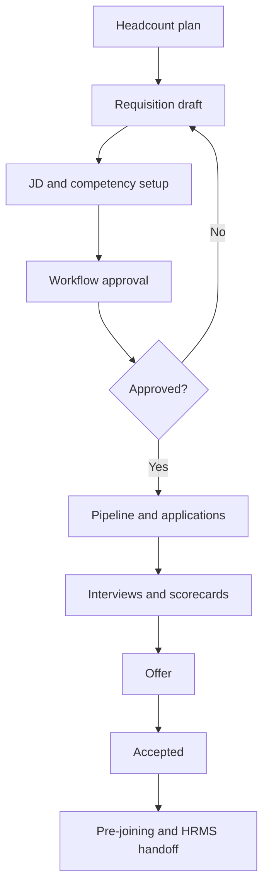

# Phase 7 — Corporate ATS Service

## Corporate requisition-to-hire flow

## 1. Objective

Build headcount, requisitions, locations/openings, JD/competencies, pipeline stages, applications, interviews, scorecards, offers, pre-joining, onboarding, job posting metadata.

## 2. Why this phase is ordered here

Corporate domain needs candidate/RBAC/config; approval automation comes next via workflow.

## 3. Business capabilities delivered

Corporate tenants can run a manual requisition-to-offer lifecycle.

## 4. Requirement IDs covered

CAT-4.1-CAT-4.11, INT-10.3 partial, INT-10.4 partial, INT-10.5 partial

## 5. Services involved

corporate ATS service, requisition/JD/application/interview/offer modules

## 6. Owned database schemas/tables

tenant.headcount_plans, requisitions, job_descriptions, applications, interviews, scorecards, offers, onboarding, job_board_postings

## 7. APIs to build

/v1/corporate-ats/headcount-plans, requisitions, job-descriptions, applications, interviews, scorecards, offers, onboarding

All APIs must follow the standard `/v1` envelope, include `request_id`, document auth requirements in OpenAPI, use cursor pagination for lists, and require idempotency keys for duplicate-prone mutations.

## 8. Events published

corporate.requisition.created, corporate.application.stage_changed, corporate.interview.scheduled, corporate.offer.accepted

All published events use the canonical event envelope and are inserted through the outbox when they follow a database mutation.

## 9. Events consumed

candidate and config events; workflow later

Consumers must be idempotent and may update only their owned tables/read models.

## 10. Background jobs/workers

SLA placeholder, stale draft cleanup, offer expiry

Workers must set tenant context, record attempts, expose metrics, and use bounded retry/backoff.

## 11. External providers involved

salary benchmark dataset stub only; no direct job board/HRMS

Provider integrations must start with sandbox/fake adapters and secret references.

## 12. Security and authorization rules

permissions for salary, confidential reqs, stage move, offers

Server-side authorization is mandatory; UI hiding is not sufficient.

## 13. Tenant isolation rules

candidate/application/requisition same tenant only

Tenant isolation applies to API, DB, cache, search, object storage, events, notifications, integrations, reports, and AI prompt context.

## 14. RLS/database requirements

corporate tables RLS; composite FKs

RLS validation and cross-tenant negative tests are required before completion.

## 15. Audit/event requirements

audit status changes, stage moves, salary/offer access

Audit records must include actor, realm, tenant, entity, action, request id, support session id where applicable, and before/after/diff where relevant.

## 16. Configuration dependencies

mandatory fields/pipeline/stages from config/workflow

Tenant-specific behavior must be driven by the configuration framework where a config key exists or is appropriate.

## 17. UI screens/pages/components to build

headcount, requisition wizard, JD editor, pipeline board, scorecards, offers

Use the shared design system, permission-aware actions, standardized loading/error/empty states, and audit-sensitive confirmation dialogs.

## 18. Frontend state/data-fetching requirements

autosave, Kanban with reason modal, permission actions

Use typed API clients, tenant-scoped query keys, route guards, and central error handling with request id display.

## 19. Test plan

headcount blocking, mandatory fields, stage history, salary masking, RLS tests

Also include unit, integration, contract, authorization, RLS, tenant leakage, idempotency, audit, and frontend route-guard tests where applicable.

## 20. Migration/data requirements

seed default pipelines and competencies

Migrations are additive, service-owned, reviewed for tenant isolation, and validated against schema drift checks.

## 21. Rollout plan

draft/JD then pipeline then offers

Rollout must use feature flags, internal tenants, seeded data, and explicit rollback notes.

## 22. Definition of done

manual corporate lifecycle complete

## 23. Risks and edge cases

building approvals ad hoc

## 24. What must NOT be done in this phase

do not call integrations or enable AI decisions

## 25. Parallelization opportunities

subdomains parallel

## 26. Dependencies on previous phases

Phases 1,2,3,5,6

## 27. Handoff checklist for the next phase

- OpenAPI and event catalog updated.
- Service-to-table ownership matrix updated.
- Required permissions and config keys documented.
- RLS, authorization, tenant leakage, idempotency, and audit tests pass.
- Frontend routes are guarded and permission-aware.
- Runbooks and rollback notes are present.
- Handoff: workflow can automate approvals
