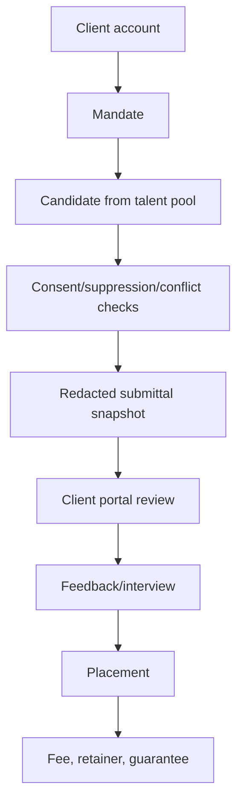

# Phase 9 — Agency ATS Service

## Agency mandate-to-placement flow

## 1. Objective

Build clients, contacts, client portal users, mandates, fee terms, retainers, submittals, redacted snapshots, feedback, placements, guarantees.

## 2. Why this phase is ordered here

Agency depends on candidate master and introduces client_id second-level isolation.

## 3. Business capabilities delivered

Agency tenants can manage client mandates and placements safely.

## 4. Requirement IDs covered

AAT-7.1-AAT-7.7, MT-1.6, SEC-3.5, SEC-3.9

## 5. Services involved

agency ATS service, client portal, submittal, placement/fee modules

## 6. Owned database schemas/tables

agency.clients, client_contacts, client_portal_users, mandates, fee_terms, submittals, snapshots, feedback, placements, guarantees

## 7. APIs to build

/v1/agency-ats/clients, mandates, submittals, client-portal, placements, guarantees

All APIs must follow the standard `/v1` envelope, include `request_id`, document auth requirements in OpenAPI, use cursor pagination for lists, and require idempotency keys for duplicate-prone mutations.

## 8. Events published

agency.client.created, agency.submittal.created, agency.feedback_received, agency.placement.recorded

All published events use the canonical event envelope and are inserted through the outbox when they follow a database mutation.

## 9. Events consumed

candidate, workflow, notification later, billing later

Consumers must be idempotent and may update only their owned tables/read models.

## 10. Background jobs/workers

client duplicate, guarantee monitor, retainer milestone trigger

Workers must set tenant context, record attempts, expose metrics, and use bounded retry/backoff.

## 11. External providers involved

none directly

Provider integrations must start with sandbox/fake adapters and secret references.

## 12. Security and authorization rules

client portal is distinct identity and scoped by client_id/mandates

Server-side authorization is mandatory; UI hiding is not sufficient.

## 13. Tenant isolation rules

tenant_id plus client_id isolation for portal

Tenant isolation applies to API, DB, cache, search, object storage, events, notifications, integrations, reports, and AI prompt context.

## 14. RLS/database requirements

agency tables RLS; ABAC client_id checks

RLS validation and cross-tenant negative tests are required before completion.

## 15. Audit/event requirements

audit redaction, submittals, feedback, fee snapshots

Audit records must include actor, realm, tenant, entity, action, request id, support session id where applicable, and before/after/diff where relevant.

## 16. Configuration dependencies

portal scope/redaction/fees from config

Tenant-specific behavior must be driven by the configuration framework where a config key exists or is appropriate.

## 17. UI screens/pages/components to build

client/mandate pages, submittal wizard, redaction preview, client portal, placement

Use the shared design system, permission-aware actions, standardized loading/error/empty states, and audit-sensitive confirmation dialogs.

## 18. Frontend state/data-fetching requirements

separate portal shell and client_id guard

Use typed API clients, tenant-scoped query keys, route guards, and central error handling with request id display.

## 19. Test plan

client isolation, redaction, competitor warning, fee snapshot tests

Also include unit, integration, contract, authorization, RLS, tenant leakage, idempotency, audit, and frontend route-guard tests where applicable.

## 20. Migration/data requirements

seed agency roles and portal scopes

Migrations are additive, service-owned, reviewed for tenant isolation, and validated against schema drift checks.

## 21. Rollout plan

clients/mandates then submittals then portal then placements

Rollout must use feature flags, internal tenants, seeded data, and explicit rollback notes.

## 22. Definition of done

redacted submittal and feedback lifecycle works

## 23. Risks and edge cases

portal leakage and contact exposure

## 24. What must NOT be done in this phase

do not invoice here or treat clients as tenants

## 25. Parallelization opportunities

client, mandate, portal, placement parallel

## 26. Dependencies on previous phases

Phases 3,5,6,8

## 27. Handoff checklist for the next phase

- OpenAPI and event catalog updated.
- Service-to-table ownership matrix updated.
- Required permissions and config keys documented.
- RLS, authorization, tenant leakage, idempotency, and audit tests pass.
- Frontend routes are guarded and permission-aware.
- Runbooks and rollback notes are present.
- Handoff: billing/reporting can consume agency events
