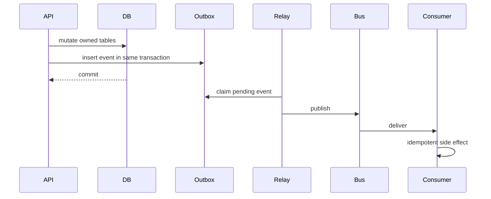
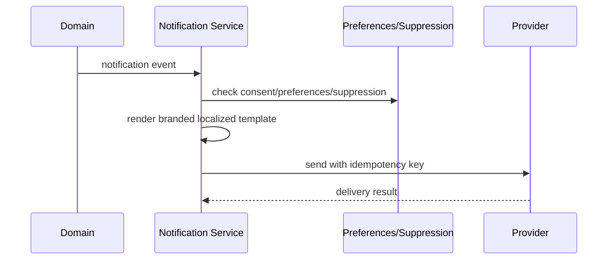

# Phase 10 — Event/Outbox, Audit Foundation, and Notification Service

## Event/outbox flow

## Notification delivery flow

## 1. Objective

Operationalize outbox, domain events, idempotency, subscriptions, notification templates, preferences, suppression, delivery attempts, audit side effects.

## 2. Why this phase is ordered here

Integrations, AI, billing, reporting, and reliable notifications require durable events/idempotency.

## 3. Business capabilities delivered

Reliable asynchronous platform and multi-channel notifications.

## 4. Requirement IDs covered

EVT-13.2, EVT-13.3, DATA-13.4, NOTIF-15.1, NOTIF-15.2, NOTIF-15.3, SEC-3.8

## 5. Services involved

event backbone, outbox relay, notification service, audit writer

## 6. Owned database schemas/tables

events.* tables; notif.* tables; tenant notification overrides/preferences; audit wrappers

## 7. APIs to build

/v1/events/..., /v1/notifications/templates, preferences, suppression-list, deliveries

All APIs must follow the standard `/v1` envelope, include `request_id`, document auth requirements in OpenAPI, use cursor pagination for lists, and require idempotency keys for duplicate-prone mutations.

## 8. Events published

notification.delivery.succeeded, event.delivery.failed, audit.log.recorded

All published events use the canonical event envelope and are inserted through the outbox when they follow a database mutation.

## 9. Events consumed

identity, workflow, corporate, agency events

Consumers must be idempotent and may update only their owned tables/read models.

## 10. Background jobs/workers

outbox relay, renderer, sender, retry/backoff, bounce suppression

Workers must set tenant context, record attempts, expose metrics, and use bounded retry/backoff.

## 11. External providers involved

email, SMS, push, WhatsApp optional

Provider integrations must start with sandbox/fake adapters and secret references.

## 12. Security and authorization rules

central suppression/preference/consent checks; bounded retries

Server-side authorization is mandatory; UI hiding is not sufficient.

## 13. Tenant isolation rules

tenant-scoped notification events/deliveries

Tenant isolation applies to API, DB, cache, search, object storage, events, notifications, integrations, reports, and AI prompt context.

## 14. RLS/database requirements

tenant notification tables RLS; worker tenant context

RLS validation and cross-tenant negative tests are required before completion.

## 15. Audit/event requirements

audit template/suppression/replay/test-send

Audit records must include actor, realm, tenant, entity, action, request id, support session id where applicable, and before/after/diff where relevant.

## 16. Configuration dependencies

channels/retries/templates from config

Tenant-specific behavior must be driven by the configuration framework where a config key exists or is appropriate.

## 17. UI screens/pages/components to build

notification template editor, delivery log, preference center, event dashboard

Use the shared design system, permission-aware actions, standardized loading/error/empty states, and audit-sensitive confirmation dialogs.

## 18. Frontend state/data-fetching requirements

template preview, delivery timeline, suppression confirmations

Use typed API clients, tenant-scoped query keys, route guards, and central error handling with request id display.

## 19. Test plan

outbox atomicity, idempotency, rendering, retry, suppression tests

Also include unit, integration, contract, authorization, RLS, tenant leakage, idempotency, audit, and frontend route-guard tests where applicable.

## 20. Migration/data requirements

seed templates and event types

Migrations are additive, service-owned, reviewed for tenant isolation, and validated against schema drift checks.

## 21. Rollout plan

email dev first then prod channels

Rollout must use feature flags, internal tenants, seeded data, and explicit rollback notes.

## 22. Definition of done

events and notifications reliable and idempotent

## 23. Risks and edge cases

duplicate sends and PII-heavy event payloads

## 24. What must NOT be done in this phase

do not let domains send email directly

## 25. Parallelization opportunities

outbox and notification streams parallel

## 26. Dependencies on previous phases

Phases 1-9 minimum core foundations

## 27. Handoff checklist for the next phase

- OpenAPI and event catalog updated.
- Service-to-table ownership matrix updated.
- Required permissions and config keys documented.
- RLS, authorization, tenant leakage, idempotency, and audit tests pass.
- Frontend routes are guarded and permission-aware.
- Runbooks and rollback notes are present.
- Handoff: integrations/AI/billing/reporting can rely on events
