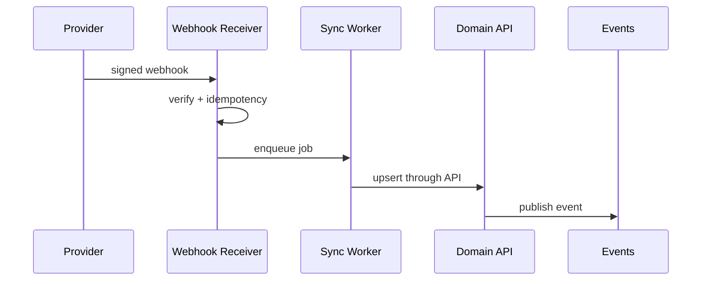

# Phase 11 — Integration Framework

## Integration sync flow

## 1. Objective

Build connector registry, tenant connector instances/settings, health checks, sync jobs/records, webhook events/subscriptions, HRMS mappings, calendar events.

## 2. Why this phase is ordered here

External sync needs events, idempotency, RBAC, config, and domain APIs.

## 3. Business capabilities delivered

Tenants can connect external systems consistently.

## 4. Requirement IDs covered

INT-10.1-INT-10.5, API-18.4, MT-1.11, SEC-3.7, DATA-13.4

## 5. Services involved

integration service, connector runtime, sync workers, webhook receiver

## 6. Owned database schemas/tables

platform.connector_*; tenant.connector_instances/settings, sync_jobs/records, webhook_events/subscriptions, calendar_events, hrms_mappings

## 7. APIs to build

/v1/integrations/connectors, instances, health, sync-jobs, webhooks, hrms-field-mappings, calendar-events

All APIs must follow the standard `/v1` envelope, include `request_id`, document auth requirements in OpenAPI, use cursor pagination for lists, and require idempotency keys for duplicate-prone mutations.

## 8. Events published

integration.connector.degraded, integration.sync.completed, integration.webhook.received

All published events use the canonical event envelope and are inserted through the outbox when they follow a database mutation.

## 9. Events consumed

corporate job/interview/onboarding events; provider webhooks

Consumers must be idempotent and may update only their owned tables/read models.

## 10. Background jobs/workers

health polling, batch/poll sync, webhook processor, retry/backoff

Workers must set tenant context, record attempts, expose metrics, and use bounded retry/backoff.

## 11. External providers involved

job boards, HRMS, calendar/video providers, partners

Provider integrations must start with sandbox/fake adapters and secret references.

## 12. Security and authorization rules

credential refs only; inbound signature verify; outbound HMAC

Server-side authorization is mandatory; UI hiding is not sufficient.

## 13. Tenant isolation rules

instances and external IDs tenant scoped

Tenant isolation applies to API, DB, cache, search, object storage, events, notifications, integrations, reports, and AI prompt context.

## 14. RLS/database requirements

connector/sync tables RLS; worker tenant context

RLS validation and cross-tenant negative tests are required before completion.

## 15. Audit/event requirements

audit connect/disconnect, credentials, mappings, manual sync

Audit records must include actor, realm, tenant, entity, action, request id, support session id where applicable, and before/after/diff where relevant.

## 16. Configuration dependencies

polling/rate-limit/provider versions from config

Tenant-specific behavior must be driven by the configuration framework where a config key exists or is appropriate.

## 17. UI screens/pages/components to build

marketplace, setup wizard, sync history, mappings, webhook subscriptions

Use the shared design system, permission-aware actions, standardized loading/error/empty states, and audit-sensitive confirmation dialogs.

## 18. Frontend state/data-fetching requirements

metadata-driven provider forms and status badges

Use typed API clients, tenant-scoped query keys, route guards, and central error handling with request id display.

## 19. Test plan

signature, sync idempotency, partial retry, mapping, tenant tests

Also include unit, integration, contract, authorization, RLS, tenant leakage, idempotency, audit, and frontend route-guard tests where applicable.

## 20. Migration/data requirements

seed connector definitions

Migrations are additive, service-owned, reviewed for tenant isolation, and validated against schema drift checks.

## 21. Rollout plan

sandbox connector then one provider at a time

Rollout must use feature flags, internal tenants, seeded data, and explicit rollback notes.

## 22. Definition of done

test connector end-to-end works

## 23. Risks and edge cases

credential leaks and duplicate records

## 24. What must NOT be done in this phase

do not put provider logic in domain services

## 25. Parallelization opportunities

registry, webhooks, workers, UI parallel

## 26. Dependencies on previous phases

Phases 5,6,7,8,10

## 27. Handoff checklist for the next phase

- OpenAPI and event catalog updated.
- Service-to-table ownership matrix updated.
- Required permissions and config keys documented.
- RLS, authorization, tenant leakage, idempotency, and audit tests pass.
- Frontend routes are guarded and permission-aware.
- Runbooks and rollback notes are present.
- Handoff: AI and billing can use integration patterns
