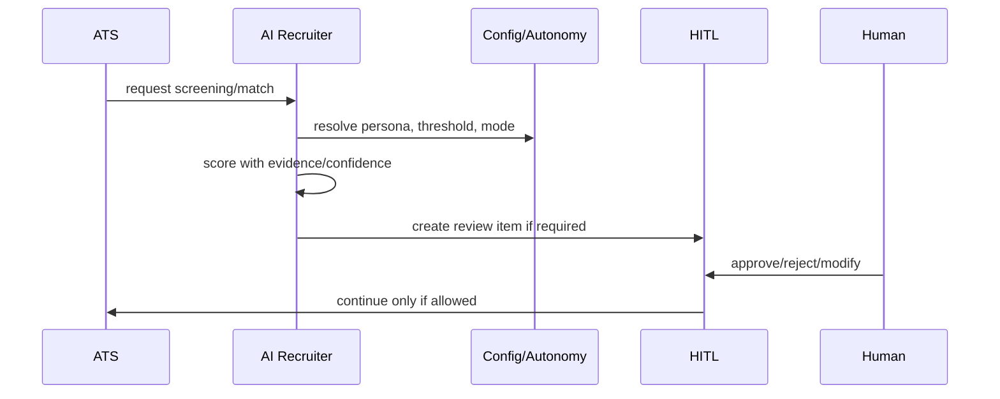

# Phase 12 — AI Recruiter Service

## AI screening + HITL flow

## 1. Objective

Build AI personas, prompt templates, agent identities, sourcing, match scores, screening results, bias flags, conversations, scheduling, joining-risk, AI usage events.

## 2. Why this phase is ordered here

AI needs candidate/ATS/config/events/integration foundations; candidate-impacting automation waits for HITL.

## 3. Business capabilities delivered

Advisory AI recruiter outputs with audit and review-required signals.

## 4. Requirement IDs covered

AIR-8.1-AIR-8.5, CAT-4.4, CAT-4.5, CAT-4.6, CAT-4.10, PA-2.12, PA-2.16

## 5. Services involved

AI recruiter service, prompt service, AI gateway, screening/sourcing/scheduling workers

## 6. Owned database schemas/tables

ai.recruiter_personas, prompts, agent identities, sourcing_runs, match_scores, screening_results, bias_flags, conversations, scheduling, ai_usage, joining_risk

## 7. APIs to build

/v1/ai-recruiter/personas, prompt-templates, sourcing-runs, match-scores, screening-results, conversations, scheduling-requests

All APIs must follow the standard `/v1` envelope, include `request_id`, document auth requirements in OpenAPI, use cursor pagination for lists, and require idempotency keys for duplicate-prone mutations.

## 8. Events published

ai.screening.completed, ai.review_required, ai.usage.recorded, ai.bias_flag.created

All published events use the canonical event envelope and are inserted through the outbox when they follow a database mutation.

## 9. Events consumed

candidate, requisition, application, config, consent/suppression events

Consumers must be idempotent and may update only their owned tables/read models.

## 10. Background jobs/workers

sourcing, scoring, screening, scheduling, usage metering

Workers must set tenant context, record attempts, expose metrics, and use bounded retry/backoff.

## 11. External providers involved

LLM providers, search/vector, integration service

Provider integrations must start with sandbox/fake adapters and secret references.

## 12. Security and authorization rules

AI agents permission-scoped; prompt context tenant filtered; no outreach without consent/HITL

Server-side authorization is mandatory; UI hiding is not sufficient.

## 13. Tenant isolation rules

one tenant per prompt/model call

Tenant isolation applies to API, DB, cache, search, object storage, events, notifications, integrations, reports, and AI prompt context.

## 14. RLS/database requirements

AI tables RLS; worker tenant context

RLS validation and cross-tenant negative tests are required before completion.

## 15. Audit/event requirements

audit model/version/input refs/output/confidence/reasoning

Audit records must include actor, realm, tenant, entity, action, request id, support session id where applicable, and before/after/diff where relevant.

## 16. Configuration dependencies

persona, model, threshold, disclosures from config

Tenant-specific behavior must be driven by the configuration framework where a config key exists or is appropriate.

## 17. UI screens/pages/components to build

persona editor, prompt library, sourcing, match explanation, screening review panels

Use the shared design system, permission-aware actions, standardized loading/error/empty states, and audit-sensitive confirmation dialogs.

## 18. Frontend state/data-fetching requirements

confidence/evidence display; no auto action buttons until HITL

Use typed API clients, tenant-scoped query keys, route guards, and central error handling with request id display.

## 19. Test plan

fake-model, tenant isolation, consent, suppression, bias, usage tests

Also include unit, integration, contract, authorization, RLS, tenant leakage, idempotency, audit, and frontend route-guard tests where applicable.

## 20. Migration/data requirements

seed versioned prompts/personas

Migrations are additive, service-owned, reviewed for tenant isolation, and validated against schema drift checks.

## 21. Rollout plan

draft/advisory only

Rollout must use feature flags, internal tenants, seeded data, and explicit rollback notes.

## 22. Definition of done

AI outputs persisted with review signals

## 23. Risks and edge cases

cross-tenant prompt leakage, autonomy too early

## 24. What must NOT be done in this phase

do not auto-reject/advance/message/schedule

## 25. Parallelization opportunities

prompt, sourcing, screening, usage parallel

## 26. Dependencies on previous phases

Phases 3,5,6,7,10,11; activation depends Phase 14

## 27. Handoff checklist for the next phase

- OpenAPI and event catalog updated.
- Service-to-table ownership matrix updated.
- Required permissions and config keys documented.
- RLS, authorization, tenant leakage, idempotency, and audit tests pass.
- Frontend routes are guarded and permission-aware.
- Runbooks and rollback notes are present.
- Handoff: HITL can review real AI outputs
