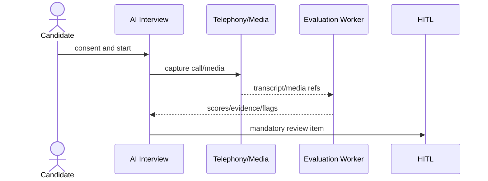

# Phase 13 — AI Interview and Telephony Service

## AI interview + HITL flow

## 1. Objective

Build AI interview sessions, question sets, responses/media, evaluations, flags, low-confidence segments, telephony configs/numbers/routes/calls/quality/live calls.

## 2. Why this phase is ordered here

Requires candidate, ATS, notification, integration, AI governance; outcomes wait for HITL.

## 3. Business capabilities delivered

AI interviews collect consented responses and produce review-required evaluations.

## 4. Requirement IDs covered

AIB-9.1, AIB-9.2, AIB-9.5, TEL-9.3, TEL-9.4, AIR-8.4, MOB-21.2 partial

## 5. Services involved

AI interview service, telephony service, media pipeline, evaluation worker

## 6. Owned database schemas/tables

ai.interview_* tables; ai.telephony_*; call_records, call_quality_metrics, live_interview_calls

## 7. APIs to build

/v1/interviews/ai-sessions, question-sets, responses, media, evaluations, telephony/config, calls, candidate-sessions

All APIs must follow the standard `/v1` envelope, include `request_id`, document auth requirements in OpenAPI, use cursor pagination for lists, and require idempotency keys for duplicate-prone mutations.

## 8. Events published

interview.response.recorded, interview.evaluation.completed, interview.review_required, telephony.call.ended, ai.usage.recorded

All published events use the canonical event envelope and are inserted through the outbox when they follow a database mutation.

## 9. Events consumed

corporate interview events, notifications, calendar/video events, config

Consumers must be idempotent and may update only their owned tables/read models.

## 10. Background jobs/workers

transcript, evaluation, media retention, call quality, telephony webhook processor

Workers must set tenant context, record attempts, expose metrics, and use bounded retry/backoff.

## 11. External providers involved

telephony, speech-to-text, media storage, LLM evaluator

Provider integrations must start with sandbox/fake adapters and secret references.

## 12. Security and authorization rules

candidate consent mandatory; limited candidate tokens; media signed URLs

Server-side authorization is mandatory; UI hiding is not sufficient.

## 13. Tenant isolation rules

session/call tenant scoped; token scoped to one session

Tenant isolation applies to API, DB, cache, search, object storage, events, notifications, integrations, reports, and AI prompt context.

## 14. RLS/database requirements

AI/telephony tables RLS

RLS validation and cross-tenant negative tests are required before completion.

## 15. Audit/event requirements

audit consent, media access, evaluations, call routing

Audit records must include actor, realm, tenant, entity, action, request id, support session id where applicable, and before/after/diff where relevant.

## 16. Configuration dependencies

consent, rubric, routing, retention from config

Tenant-specific behavior must be driven by the configuration framework where a config key exists or is appropriate.

## 17. UI screens/pages/components to build

session setup, question editor, candidate interview UI, evaluation detail, call monitor

Use the shared design system, permission-aware actions, standardized loading/error/empty states, and audit-sensitive confirmation dialogs.

## 18. Frontend state/data-fetching requirements

mobile upload/resume, consent gate, no stage change without HITL

Use typed API clients, tenant-scoped query keys, route guards, and central error handling with request id display.

## 19. Test plan

consent, token, media URL, transcript, telephony webhook, RLS tests

Also include unit, integration, contract, authorization, RLS, tenant leakage, idempotency, audit, and frontend route-guard tests where applicable.

## 20. Migration/data requirements

seed rubrics/questions

Migrations are additive, service-owned, reviewed for tenant isolation, and validated against schema drift checks.

## 21. Rollout plan

async sandbox then media then live telephony

Rollout must use feature flags, internal tenants, seeded data, and explicit rollback notes.

## 22. Definition of done

evaluation generated and review item emitted

## 23. Risks and edge cases

recording without consent; media leakage

## 24. What must NOT be done in this phase

do not auto-advance/reject

## 25. Parallelization opportunities

media, telephony, evaluation, UI parallel

## 26. Dependencies on previous phases

Phases 6,7,10,11,12; activation depends Phase 14

## 27. Handoff checklist for the next phase

- OpenAPI and event catalog updated.
- Service-to-table ownership matrix updated.
- Required permissions and config keys documented.
- RLS, authorization, tenant leakage, idempotency, and audit tests pass.
- Frontend routes are guarded and permission-aware.
- Runbooks and rollback notes are present.
- Handoff: HITL reviews interview outputs
