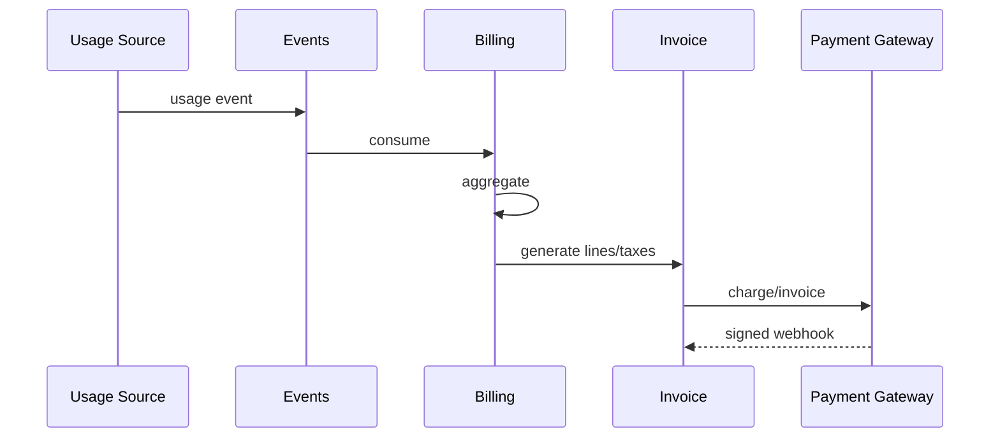

# Phase 15 — Billing, Subscription, and Metering Service

## Billing metering flow

## 1. Objective

Build subscriptions, items, add-ons, quota overrides, usage events/aggregations, addresses, payment methods, invoices, taxes, payment attempts, credits.

## 2. Why this phase is ordered here

Billing requires plans, tenant lifecycle, events, notifications, and real usage event producers.

## 3. Business capabilities delivered

Monetization and usage visibility.

## 4. Requirement IDs covered

BILL-16.1-BILL-16.4, MT-1.10, PA-2.2-PA-2.5

## 5. Services involved

billing service, usage aggregator, invoice worker, payment adapter

## 6. Owned database schemas/tables

billing.subscriptions, subscription_items, addons, quota_overrides, usage_events, usage_aggregations, invoices, line_items, taxes, payments, credits

## 7. APIs to build

/v1/billing/subscription, plans, addons, usage, invoices, payment-methods, credits, payment webhooks, quota-status

All APIs must follow the standard `/v1` envelope, include `request_id`, document auth requirements in OpenAPI, use cursor pagination for lists, and require idempotency keys for duplicate-prone mutations.

## 8. Events published

billing.usage.recorded, billing.invoice.generated, billing.payment.succeeded, billing.quota.threshold_reached

All published events use the canonical event envelope and are inserted through the outbox when they follow a database mutation.

## 9. Events consumed

AI/telephony/integration usage, tenant lifecycle, payment webhooks

Consumers must be idempotent and may update only their owned tables/read models.

## 10. Background jobs/workers

usage aggregation, invoice generation, dunning, reconciliation

Workers must set tenant context, record attempts, expose metrics, and use bounded retry/backoff.

## 11. External providers involved

payment gateway, tax/accounting optional

Provider integrations must start with sandbox/fake adapters and secret references.

## 12. Security and authorization rules

no raw card data; signed payment webhooks; billing permissions

Server-side authorization is mandatory; UI hiding is not sufficient.

## 13. Tenant isolation rules

billing rows tenant scoped; plans global

Tenant isolation applies to API, DB, cache, search, object storage, events, notifications, integrations, reports, and AI prompt context.

## 14. RLS/database requirements

billing RLS; worker tenant context

RLS validation and cross-tenant negative tests are required before completion.

## 15. Audit/event requirements

audit subscription, payment method, invoice, credits, manual adjustments

Audit records must include actor, realm, tenant, entity, action, request id, support session id where applicable, and before/after/diff where relevant.

## 16. Configuration dependencies

plan entitlements and thresholds from config/platform

Tenant-specific behavior must be driven by the configuration framework where a config key exists or is appropriate.

## 17. UI screens/pages/components to build

billing page, usage dashboard, invoices, payment methods, quota banners

Use the shared design system, permission-aware actions, standardized loading/error/empty states, and audit-sensitive confirmation dialogs.

## 18. Frontend state/data-fetching requirements

currency formatting, gateway redirect, confirmations

Use typed API clients, tenant-scoped query keys, route guards, and central error handling with request id display.

## 19. Test plan

usage idempotency, invoice, tax, webhook, quota, RLS tests

Also include unit, integration, contract, authorization, RLS, tenant leakage, idempotency, audit, and frontend route-guard tests where applicable.

## 20. Migration/data requirements

seed plans/quota/addons

Migrations are additive, service-owned, reviewed for tenant isolation, and validated against schema drift checks.

## 21. Rollout plan

manual/sandbox then production; quotas warn-only first

Rollout must use feature flags, internal tenants, seeded data, and explicit rollback notes.

## 22. Definition of done

usage to invoice flow reconciles

## 23. Risks and edge cases

duplicate charges and missing usage

## 24. What must NOT be done in this phase

do not infer usage from private AI tables

## 25. Parallelization opportunities

subscription, usage, invoice, payment UI parallel

## 26. Dependencies on previous phases

Phases 4,10,11,12,13,14

## 27. Handoff checklist for the next phase

- OpenAPI and event catalog updated.
- Service-to-table ownership matrix updated.
- Required permissions and config keys documented.
- RLS, authorization, tenant leakage, idempotency, and audit tests pass.
- Frontend routes are guarded and permission-aware.
- Runbooks and rollback notes are present.
- Handoff: reporting can use billing facts
