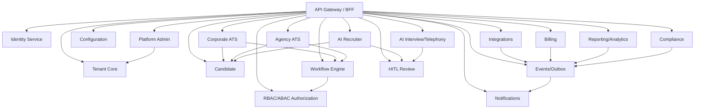

# Phase 19 — Production Hardening, SRE, and Enterprise Readiness

## Overall service dependency graph

## 1. Objective

Harden CI/CD, environments, canary/rollback, feature flags, SLO/error budgets, autoscaling, DR, backups, security/load tests, runbooks, incident response.

## 2. Why this phase is ordered here

Final consolidation after product, AI, billing, reporting, compliance, and white-label surfaces exist.

## 3. Business capabilities delivered

Enterprise pilot/GA operational readiness.

## 4. Requirement IDs covered

DEPLOY-17.1-DEPLOY-17.5, CICD-20.1-CICD-20.4, API-18.2, PA-2.11, PA-2.14, Phase 7 readiness

## 5. Services involved

all services, SRE platform, observability, deployment/release management

## 6. Owned database schemas/tables

platform.deployments, slo_definitions, error_budget_status, audit, support, compliance evidence

## 7. APIs to build

/v1/platform-admin/deployments, slo, error-budgets, release-gates, incidents

All APIs must follow the standard `/v1` envelope, include `request_id`, document auth requirements in OpenAPI, use cursor pagination for lists, and require idempotency keys for duplicate-prone mutations.

## 8. Events published

deployment.completed, deployment.rolled_back, slo.error_budget_burned, incident.resolved

All published events use the canonical event envelope and are inserted through the outbox when they follow a database mutation.

## 9. Events consumed

all health/metrics/audit/deployment events

Consumers must be idempotent and may update only their owned tables/read models.

## 10. Background jobs/workers

synthetic monitoring, backup verification, DR drill, scans, SLO calculator

Workers must set tenant context, record attempts, expose metrics, and use bounded retry/backoff.

## 11. External providers involved

cloud/Kubernetes, observability, incident tool, WAF/CDN, KMS/vault

Provider integrations must start with sandbox/fake adapters and secret references.

## 12. Security and authorization rules

least privilege IAM, WAF, secrets vault, break-glass audit

Server-side authorization is mandatory; UI hiding is not sufficient.

## 13. Tenant isolation rules

tenant isolation validated under load across all layers

Tenant isolation applies to API, DB, cache, search, object storage, events, notifications, integrations, reports, and AI prompt context.

## 14. RLS/database requirements

RLS validation in CI/pre-prod and monitoring

RLS validation and cross-tenant negative tests are required before completion.

## 15. Audit/event requirements

audit coverage is release gate

Audit records must include actor, realm, tenant, entity, action, request id, support session id where applicable, and before/after/diff where relevant.

## 16. Configuration dependencies

feature flags, canaries, SLOs, quotas from config

Tenant-specific behavior must be driven by the configuration framework where a config key exists or is appropriate.

## 17. UI screens/pages/components to build

SRE dashboards, release gates, incidents, tenant health, evidence

Use the shared design system, permission-aware actions, standardized loading/error/empty states, and audit-sensitive confirmation dialogs.

## 18. Frontend state/data-fetching requirements

error boundaries, request-id, maintenance banners, performance budgets

Use typed API clients, tenant-scoped query keys, route guards, and central error handling with request id display.

## 19. Test plan

regression, load, chaos, DR, security, tenant leakage, accessibility

Also include unit, integration, contract, authorization, RLS, tenant leakage, idempotency, audit, and frontend route-guard tests where applicable.

## 20. Migration/data requirements

zero-downtime expand/migrate/contract

Migrations are additive, service-owned, reviewed for tenant isolation, and validated against schema drift checks.

## 21. Rollout plan

dogfood -> sandbox -> pilots -> GA

Rollout must use feature flags, internal tenants, seeded data, and explicit rollback notes.

## 22. Definition of done

all enterprise gates pass

## 23. Risks and edge cases

late leakage, migration downtime, weak runbooks

## 24. What must NOT be done in this phase

do not add net-new business scope

## 25. Parallelization opportunities

SRE/security/QA/frontend perf parallel

## 26. Dependencies on previous phases

all previous phases

## 27. Handoff checklist for the next phase

- OpenAPI and event catalog updated.
- Service-to-table ownership matrix updated.
- Required permissions and config keys documented.
- RLS, authorization, tenant leakage, idempotency, and audit tests pass.
- Frontend routes are guarded and permission-aware.
- Runbooks and rollback notes are present.
- Handoff: GA readiness package complete
