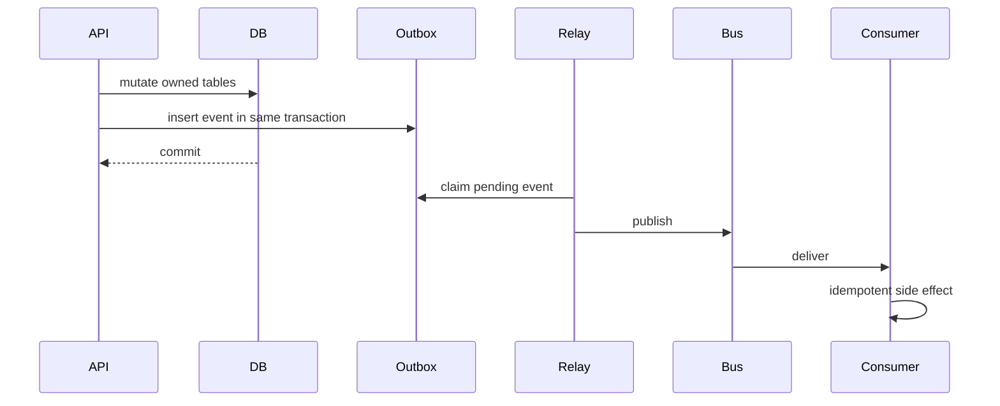

# 26 — Event Catalog and Outbox Plan

## Event/outbox flow

## Event families

| Family | Meaning | Publisher | Consumers |
| --- | --- | --- | --- |
| identity.* | login, MFA, sessions, verification | Identity | security, notification |
| tenant.* | org/users/roles/API keys | Tenant/RBAC | config, reports |
| platform.* | tenant lifecycle/support/features | Platform Admin | audit, billing, reports |
| candidate.* | profile/consent/documents | Candidate | ATS, agency, AI, compliance |
| corporate.* | requisitions/applications/offers | Corporate ATS | workflow, integrations, reports |
| workflow.* | templates/instances/approvals | Workflow | notifications, domains |
| agency.* | clients/mandates/submittals/placements | Agency ATS | billing, reports |
| notification.* | delivery lifecycle | Notifications | reports, compliance |
| integration.* | sync/webhooks/connector health | Integrations | domains, reports |
| ai.* | AI runs/screening/usage/bias | AI Services | HITL, billing, governance |
| hitl.* | review decisions/overrides | HITL | AI continuation, reports |
| billing.* | usage/invoices/payments | Billing | reports, platform admin |
| compliance.* | DSR/retention/legal/evidence | Compliance | audit, notifications |

## Envelope

Events include event_id, event_type, event_version, occurred_at, tenant_id, actor, source_service, correlation_id, request_id, idempotency_key, entity_ref, and payload.

## Rules

Events are inserted in the same transaction as state change. Consumers are idempotent. Replay is platform-admin only and requires reason, scope, audit, and safety review for sensitive events.
