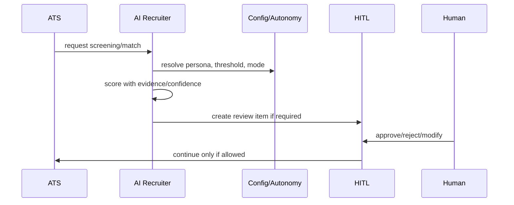
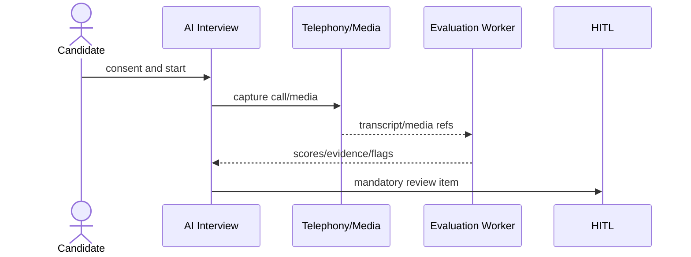

# 28 — AI Governance and HITL Plan

## AI features that can ship early

AI JD drafts, inclusive language findings, salary benchmark suggestions, match explanations, screening recommendations, scheduling proposals, and interview evaluation drafts can ship early only as advisory/review-required outputs.

## AI features that must wait

Auto-rejection, auto-advancing stages, auto-sending candidate messages, auto-scheduling external interviews, auto-submitting candidates to clients, tenant data fine-tuning, and shared benchmarking pools must wait for HITL/governance approval.

## Always human-approved initially

Candidate rejection, AI-based stage movement, candidate communications, interview evaluation use, joining-risk intervention, and client-facing AI summaries.

## Autonomy modes

manual_only, review_required, auto_with_review_sampling, auto_allowed. Candidate-impacting actions default to review_required/manual_only.

## Prompt/template versioning

Prompt templates are versioned, audited, rollback-capable, and tied to policy flags, required disclosures, banned topics, model/provider/version, and jurisdiction rules.

## Persistence

Store model/provider/version, input refs, output, reasoning summary, evidence refs, confidence, bias flags, raw response snapshot in allowed JSONB only, and review item id.

## AI screening + HITL flow

## AI interview + HITL flow

## Quality monitoring

Human overrides feed metrics. Sustained override thresholds create governance alerts. Platform admins see aggregates unless audited support/governance access is approved.
